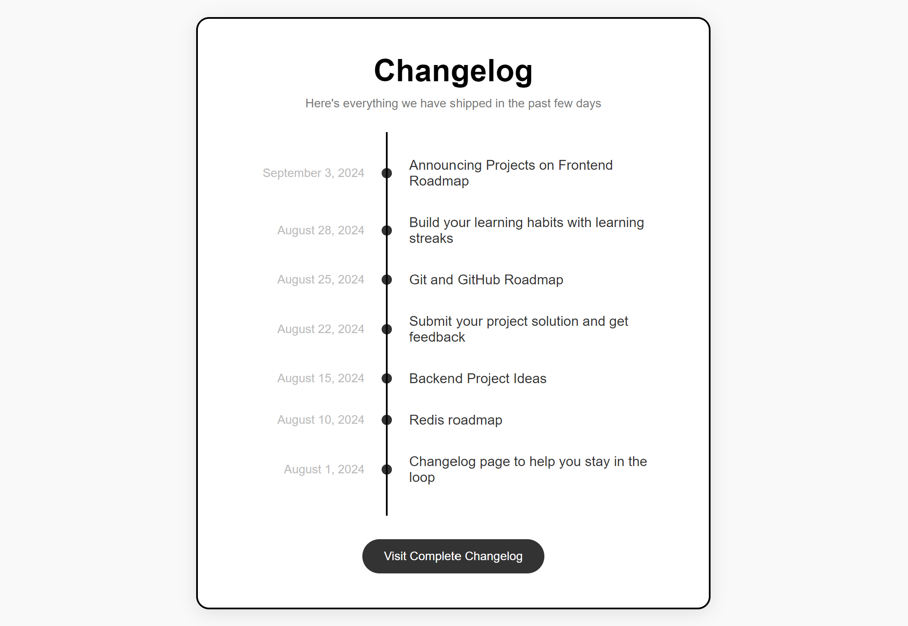

# Changelog Component

## Description

The Changelog Component is a simple and stylish way to display a chronological list of updates, releases, or changes for your project. Designed to be easily integrated into websites or applications, this component provides a clean timeline view of significant events or modifications.

This project features a well-organized layout with a header, a timeline of updates, and a footer with a link to the complete changelog. It is fully responsive and customizable to fit various design needs.

## Features

- **Clean Design:** Minimalist layout with a modern aesthetic.
- **Responsive:** Works well on different screen sizes and devices.
- **Customizable:** Easy to adjust styles and content to fit your needs.
- **Interactive Elements:** Includes a button to visit the complete changelog on GitHub.

## Visuals

  

## Installation

To get started with the Changelog Component, follow these steps:

1. **Clone the Repository:**

   ```bash
   git clone https://gitlab.com/Yashi-Singh-9/changelog-component.git
   ```

2. **Navigate to the Project Directory:**

   ```bash
   cd changelog-component
   ```

3. **Open the Project:**

   You can open the `index.html` file in your preferred web browser to view the component.

   If you want to integrate this component into an existing project, simply copy the HTML and CSS code into your project files.

## Support

For any issues or questions, please open an issue on the [GitLab Issues Page](https://gitlab.com/Yashi-Singh-9/changelog-component/-/issues).

## Roadmap

Future improvements and features may include:
- Additional customization options for the timeline.
- Integration with backend services to automatically populate the changelog.
- Support for different themes and color schemes.

## Contributing

Contributions are welcome! If you’d like to contribute to the project, please follow these steps:
1. Fork the repository.
2. Create a new branch for your changes.
3. Make your modifications.
4. Submit a pull request with a clear description of your changes.

**Note:** Ensure your changes do not break existing functionality and that the code adheres to the project’s style guide.

## Authors and Acknowledgments

- **Yashi Singh:** Developer and maintainer of the Changelog Component.
- **Special Thanks:** To everyone who has contributed to or supported the development of this project.

## License

This project is licensed under the MIT License. See the [LICENSE](LICENSE) file for more details.

## Project Status

This project is actively maintained. However, if you find any issues or have suggestions for improvements, please feel free to reach out or contribute.
